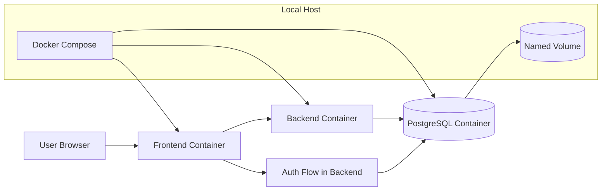

# Grocery List Manager — Architecture Document

## 1. Overview

This document describes a recommended architecture for the Grocery List Manager MVP. The design favors a simple, modular structure that supports rapid iteration while staying aligned with the requirements for authentication, multi-list management, categories, item check-off, and cross-device sync.

The architecture is intentionally split into clear layers so each part can be changed independently as the product evolves.

---

## 2. Architectural Goals

- Build the MVP in small, testable slices
- Keep the UI responsive and mobile-friendly
- Ensure user data is isolated and secure
- Support refresh-on-load sync across devices
- Keep deployment and operations simple for early releases

---

## 3. Recommended Solution Architecture

### 3.1 High-Level Components

- Frontend web app
  - Responsive UI for desktop and mobile
  - Handles auth screens, list overview, list detail, and category management
- Backend API
  - Exposes REST endpoints for users, lists, items, categories, and auth
  - Implements validation, authorization, and persistence rules
- Database
  - Stores users, lists, categories, items, and sync-relevant metadata
- Authentication layer
  - Handles registration, login, session persistence, and access control
- Local Docker deployment stack
  - Runs the frontend, backend, and database as separate containers on a single host
  - Uses Docker Compose to simplify local setup and orchestration
- Optional local admin tooling
  - Adminer or pgAdmin for inspecting the PostgreSQL database during development

---

## 4. Suggested Tech Stack

### Frontend

- React + TypeScript
- Vite or Next.js
- React Router
- TanStack Query or similar server-state management
- Tailwind CSS or a simple component library

### Backend

- Node.js + TypeScript
- REST API layer
- Validation and error handling middleware
- Optional ORM such as Prisma

### Data

- PostgreSQL
- Prisma ORM or SQL migrations

### Auth

- Email/password authentication
- Session-based auth or JWT access tokens with secure cookies
- Password hashing using Argon2 or bcrypt

### Tooling

- ESLint + Prettier
- Vitest or Jest for unit tests
- Playwright for end-to-end testing
- Docker for local consistency
- GitHub Actions for CI/CD

---

## 5. System Diagram

---

## 6. Core Application Layers

### 6.1 Presentation Layer

Responsibilities:

- Render authentication screens
- Display list overview and detail views
- Handle item add/edit/delete and check-off interactions
- Provide mobile-first layouts and responsive behavior

Key concerns:

- Fast interaction feedback
- Clear loading and error states
- Accessibility and touch-friendly controls

### 6.2 Application Layer

Responsibilities:

- Validate requests
- Enforce ownership rules
- Apply business rules for lists, items, and categories
- Handle optimistic UI updates and refresh-based sync

Key concerns:

- Secure access to each user’s data
- Consistent update behavior across devices
- Clear save/sync status messaging

### 6.3 Data Layer

Responsibilities:

- Persist users, lists, categories, and items
- Enforce relationships and constraints
- Support refresh-based fetching and data consistency

Key data entities:

- User
- List
- Category
- Item

### 6.4 Infrastructure Layer

Responsibilities:

- Host the frontend and API
- Manage environment variables and secrets
- Provide monitoring, logs, and backups

---

## 7. Data Model Summary

### Users

- id
- email
- password_hash
- created_at
- updated_at

### Lists

- id
- user_id
- name
- description
- created_at
- updated_at
- sort_order

### Categories

- id
- user_id
- name
- sort_order
- is_default
- created_at
- updated_at

### Items

- id
- list_id
- category_id
- name
- quantity
- note
- is_checked
- checked_at
- sort_order
- created_at
- updated_at

---

## 8. Runtime Flow

### 8.1 Authentication Flow

1. User submits registration or login form
2. Frontend sends request to auth API
3. Backend validates input and stores or verifies credentials
4. Session or token is issued
5. Frontend stores auth state and redirects to protected views

### 8.2 List and Item Flow

1. User opens the overview or list detail screen
2. Frontend requests current data from API
3. API loads data for the authenticated user from PostgreSQL
4. User performs add/edit/check/delete operations
5. UI updates immediately where appropriate
6. Backend writes changes and confirms persistence

### 8.3 Sync Strategy for MVP

The MVP uses refresh-on-load behavior:

- Fetch latest data on login
- Fetch latest data on initial page load
- Fetch latest data on navigation between major views

No real-time polling or WebSockets are required for v1.

---

## 9. Local Docker Deployment Architecture

### Recommended local deployment model

For a local server, Docker is a strong fit because it keeps the app environment consistent and makes it easy to restart or rebuild services.

- Frontend container: serves the web app
- Backend container: runs the API and authentication logic
- Database container: runs PostgreSQL
- Optional admin container: Adminer or pgAdmin for local database inspection
- Docker Compose: manages startup order, networking, and environment variables

### Suggested services

- Frontend: exposed on port 3001
- Backend API: exposed on port 4000
- PostgreSQL: exposed on port 5432
- Adminer: exposed on port 8081 (optional)

### Networking and persistence

- All containers share a private Docker network
- The backend connects to PostgreSQL using the service name `db`
- PostgreSQL data is stored in a named Docker volume so it survives container restarts
- Environment values are provided through a `.env` file or Compose environment block

### Local deployment flow

1. Start Docker on the host machine
2. Run the Compose stack
3. Apply database migrations
4. Seed default categories and initial data
5. Open the app in a browser on the host machine

### Why this works well for the MVP

- Easy to run on a home server or development machine
- Keeps the stack simple and reproducible
- Makes it straightforward to test changes without touching the host OS
- Provides a good stepping stone toward cloud deployment later

### Future hosting direction

Once the local deployment is stable, the same containerized app can be moved to a cloud-hosted container platform with minimal architecture changes.

---

## 10. Development Workflow

### Local Development

- Frontend runs locally in dev mode
- Backend runs locally with local environment variables
- PostgreSQL runs locally via Docker or a managed local instance
- Tests run before merges

### CI/CD

- Lint and tests run on every pull request
- Build artifacts are produced automatically
- Deployment occurs after merge to the main branch

---

## 11. Operational Considerations

### Security

- HTTPS everywhere
- Passwords hashed before storage
- Authenticated routes protected server-side
- Secrets stored outside source control

### Reliability

- Database backups enabled
- Error logging and monitoring in place
- Graceful handling of failed writes and network errors

### Observability

- Request logs
- Error tracking
- Basic performance monitoring
- User-facing sync/saving indicators

---

## 12. Recommended Implementation Phasing

This architecture supports the phased plan already outlined:

1. Foundation and local environment setup
2. Authentication and protected routes
3. Lists CRUD
4. Items and quick add
5. Categories and grouping
6. Check-off and shopping flow
7. Sync and persistence
8. Polish and hardening

---

## 13. Summary

The proposed architecture keeps the MVP practical and maintainable:

- A responsive frontend for the shopping experience
- A backend API for secure business logic
- PostgreSQL for durable user data
- Cloud hosting and monitoring for a real-world deployment path

This setup is simple enough for the first version but structured well enough to evolve into a more advanced multi-device experience later.
