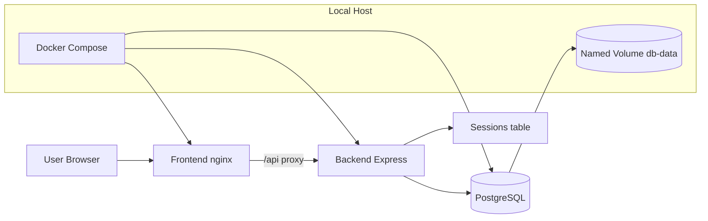

# Grocery List Manager — Architecture Document

## 1. Overview

This document describes the architecture for the Grocery List Manager MVP. The design favors a simple modular monolith that supports rapid iteration while staying aligned with the requirements for authentication, multi-list management, categories, item check-off, and cross-device sync.

Primary deployment target for early releases is a **local or home-server Docker Compose stack**. Cloud hosting is a later step using the same containerized services.

---

## 2. Architectural Goals

- Build the MVP in small, testable slices
- Keep the UI responsive and mobile-friendly
- Ensure user data is isolated and secure
- Support refresh-on-load sync across devices
- Keep deployment and operations simple for early releases
- Prefer reversible decisions; avoid premature microservices

---

## 3. Solution Architecture

### 3.1 High-Level Components

- **Frontend web app**
  - Responsive UI for desktop and mobile
  - Auth screens, list overview, list detail, and category management
  - Optimistic UI and client-side server-state cache
- **Backend API**
  - REST endpoints for auth, lists, items, and categories
  - Validation, authorization, and business rules
- **Database**
  - PostgreSQL for users, lists, categories, items, and sessions
- **Authentication (inside backend)**
  - Registration, login, logout, session cookies, access control
  - Not a separate deployable service in v1
- **Local Docker deployment stack**
  - Frontend, backend, and database as separate containers
  - Docker Compose for networking, env, and startup order
- **Optional local admin tooling**
  - Adminer for inspecting PostgreSQL during development

### 3.2 Dependency Direction

```
Browser → Frontend (UI only)
              ↓ HTTP (same origin /api proxy preferred)
         Backend API (auth + rules)
              ↓
         PostgreSQL
```

The frontend never talks to the database. Business rules and ownership checks live in the backend.

---

## 4. Locked Tech Stack

These choices match the Phase 0 scaffold and close open alternatives.

### Frontend

- React 18 + TypeScript
- **Vite** (SPA; not Next.js for v1)
- React Router
- **TanStack Query** for server state, cache invalidation, and mutation status
- Tailwind CSS (or a lightweight component library if preferred later)

### Backend

- Node.js + TypeScript
- **Express** REST API
- Validation middleware (e.g. Zod)
- Structured error handling middleware

### Data

- **PostgreSQL** 15+
- **Prisma** ORM + migrations

### Auth

- Email/password authentication
- **httpOnly session cookie** (server-side session store in PostgreSQL)
- Password hashing with **Argon2id**
- No JWT-in-localStorage for v1

### Tooling

- ESLint + Prettier
- Vitest for unit/integration tests
- Playwright for end-to-end tests
- Docker + Docker Compose for local consistency
- GitHub Actions for CI/CD and optional self-hosted deploy

---

## 5. System Diagram


```mermaid
flowchart LR
    U[User Browser] --> FE[Frontend nginx]
    FE -->|"/api proxy"| BE[Backend Express]
    BE --> DB[(PostgreSQL)]
    BE --> SESS[Sessions table]

    subgraph Local Host
        DC[Docker Compose]
        V[(Named Volume db-data)]
    end

    DC --> FE
    DC --> BE
    DC --> DB
    DB --> V
```

---

## 6. Core Application Layers

### 6.1 Presentation Layer (Frontend)

Responsibilities:

- Render authentication screens and protected app shell
- Display list overview, list detail, and category management
- Handle item add/edit/delete and check-off interactions
- Optimistic UI updates and mutation status (saving / saved / error)
- Mobile-first layouts, accessibility, touch-friendly drag handles

Key concerns:

- Interaction feedback within ~200 ms (NFR-01)
- Clear loading and error states
- Refresh data on login, page load, and major navigation

### 6.2 Application Layer (Backend)

Responsibilities:

- Authenticate requests via session cookie
- Validate request bodies and path params
- Enforce ownership and business rules
- Orchestrate transactions (e.g. category delete + item reassignment)
- Return consistent JSON success/error shapes

Key concerns:

- Secure access to each user’s data (no IDOR via raw resource IDs)
- Consistent write behavior under concurrent last-write-wins updates
- Never trust a client-supplied `user_id`

### 6.3 Data Layer

Responsibilities:

- Persist users, sessions, lists, categories, and items
- Enforce relationships, uniqueness, and cascade rules in the schema
- Migrations via Prisma

Key data entities:

- User
- Session
- List
- Category
- Item

### 6.4 Infrastructure Layer

Responsibilities:

- Host the frontend and API containers
- Manage environment variables and secrets
- Logging, backups, and (later) monitoring

---

## 7. Data Model Summary

IDs are UUIDs (`gen_random_uuid()` / Prisma `uuid()`).

### Users

| Field | Notes |
|-------|--------|
| id | UUID PK |
| email | Unique; store lowercased |
| password_hash | Argon2id; never returned to client |
| created_at | |
| updated_at | |

### Sessions

| Field | Notes |
|-------|--------|
| id | Opaque session id (cookie value is hashed or random secret) |
| user_id | FK → users, cascade delete |
| expires_at | Absolute expiry; sliding refresh optional |
| created_at | |

### Lists

| Field | Notes |
|-------|--------|
| id | UUID PK |
| user_id | FK → users; owner |
| name | 1–100 chars |
| description | Optional, 0–500 chars |
| sort_order | Optional manual order |
| created_at | |
| updated_at | Bump on list or nested item changes where practical |

**Indexes:** `(user_id)`, overview default sort `updated_at DESC`.

### Categories

| Field | Notes |
|-------|--------|
| id | UUID PK |
| user_id | FK → users; categories are per-user |
| name | 1–50 chars; **unique per user** `(user_id, name)` |
| sort_order | Display order in list detail |
| is_default | Seeded defaults; still renameable/reorderable |
| created_at | |
| updated_at | |

**Indexes:** `(user_id, sort_order)`, unique `(user_id, name)`.

### Items

| Field | Notes |
|-------|--------|
| id | UUID PK |
| list_id | FK → lists **ON DELETE CASCADE** |
| category_id | FK → categories (reassign in app before category delete) |
| name | 1–200 chars |
| quantity | Optional free-text |
| note | Optional |
| is_checked | Default false |
| checked_at | Set on check; cleared on uncheck |
| sort_order | Position **within (list_id, category_id)** |
| created_at | |
| updated_at | |

**Indexes:** `(list_id)`, `(list_id, category_id, sort_order)`.

### Relationships and invariants

- One user has many lists, categories, and sessions
- One list has many items; deleting a list deletes its items (cascade)
- Categories are per-user and shared across that user’s lists
- Every item belongs to exactly one list and one category
- Items have **no** `user_id`; ownership is transitive via `list.user_id`
- Deleting a category requires reassigning affected items in a **single transaction**
- On successful registration: create user + seed default categories in one transaction

### Default categories (seed on register)

Produce, Dairy, Meat & Seafood, Bakery, Frozen, Pantry, Beverages, Household, Personal Care, Other

### Concurrent edits (v1)

- **Last-write-wins** per resource (full-row update by primary key)
- No optimistic locking / version column in v1
- Check-off is a simple boolean update; concurrent toggles may race; acceptable for MVP

---

## 8. Authorization

### Rules

1. Every authenticated route resolves `userId` from the **server session**, never from the request body.
2. **Lists / categories:** `resource.user_id = session.userId`.
3. **Items:** ownership via list join:
   ```sql
   items.list_id → lists.id AND lists.user_id = :sessionUserId
   ```
4. Return **404** (not 403) for resources that exist but belong to another user, when practical, to avoid leaking existence.
5. Unauthenticated access to protected routes returns **401**.

### Registration side effects

In one DB transaction:

1. Insert user (hashed password)
2. Insert default category rows for that `user_id` with stable initial `sort_order`

---

## 9. API Surface (v1)

Base path: `/api`. JSON request/response bodies.

### Error shape

```json
{
  "error": {
    "code": "VALIDATION_ERROR",
    "message": "Human-readable message",
    "details": []
  }
}
```

Common codes: `UNAUTHORIZED`, `FORBIDDEN`, `NOT_FOUND`, `VALIDATION_ERROR`, `CONFLICT` (e.g. duplicate email or category name).

### Auth

| Method | Path | Auth | Description |
|--------|------|------|-------------|
| POST | `/api/auth/register` | No | Create account; set session cookie; seed categories |
| POST | `/api/auth/login` | No | Verify credentials; set session cookie |
| POST | `/api/auth/logout` | Yes | Clear session |
| GET | `/api/auth/me` | Yes | Current user profile (id, email) |

Session cookie: `httpOnly`, `SameSite=Lax`, `Secure` in production (HTTPS), path `/`.

### Lists

| Method | Path | Description |
|--------|------|-------------|
| GET | `/api/lists` | All lists for current user (include item counts) |
| POST | `/api/lists` | Create list |
| GET | `/api/lists/:listId` | List detail metadata |
| PATCH | `/api/lists/:listId` | Rename / update description |
| DELETE | `/api/lists/:listId` | Delete list + items |

### Items

| Method | Path | Description |
|--------|------|-------------|
| GET | `/api/lists/:listId/items` | Items for list (grouped client-side by category) |
| POST | `/api/lists/:listId/items` | Add item |
| PATCH | `/api/items/:itemId` | Edit fields / check-off / reorder |
| DELETE | `/api/items/:itemId` | Delete item |
| POST | `/api/lists/:listId/items/clear-checked` | Clear all checked items (optional v1 Should) |

### Categories

| Method | Path | Description |
|--------|------|-------------|
| GET | `/api/categories` | All categories for current user |
| POST | `/api/categories` | Create custom category |
| PATCH | `/api/categories/:categoryId` | Rename / reorder |
| DELETE | `/api/categories/:categoryId` | Delete; body includes `reassignToCategoryId` |

### Health

| Method | Path | Auth | Description |
|--------|------|------|-------------|
| GET | `/health` | No | Liveness for Compose / probes |

---

## 10. Runtime Flow

### 10.1 Authentication Flow

1. User submits registration or login form
2. Frontend `POST`s to auth API (same origin `/api/...`)
3. Backend validates input and stores or verifies credentials
4. Backend creates a session row and sets httpOnly cookie
5. Frontend calls `/api/auth/me` (or uses register/login response) and routes to protected views
6. Protected FE routes redirect to login when `/api/auth/me` returns 401

### 10.2 List and Item Flow

1. User opens overview or list detail
2. Frontend fetches via TanStack Query
3. API loads data scoped to the session user
4. User mutates (add/edit/check/delete)
5. UI updates optimistically where appropriate
6. Backend persists and confirms; FE shows save status / retries on failure

### 10.3 Sync Strategy for MVP

Refresh-on-load only:

- Fetch latest data on login
- Fetch latest data on initial page load
- Fetch latest data on navigation between major views
- Invalidate/refetch affected queries after successful mutations

No real-time polling or WebSockets in v1.

---

## 11. Local Docker Deployment Architecture

### Services

| Service | Role | Host port (default) |
|---------|------|---------------------|
| frontend | nginx static SPA; proxies `/api` → backend | **3000** (`FRONTEND_PORT`) |
| backend | Express API + auth | **4000** (`BACKEND_PORT`) |
| db | PostgreSQL | **5432** (`DB_PORT`) — prefer localhost-only if host is shared |
| adminer | Optional DB UI | **8081** (`ADMINER_PORT`) — dev only |

Ports are env-overridable via `.env`. Architecture defaults match `docker-compose.yml` and `.env.example`.

### Networking and API access

- All app containers share a private Docker network
- Backend connects to Postgres as host `db` (Compose service name)
- **Preferred:** frontend nginx proxies `/api` and `/health` to the backend so the browser uses a **single origin** (simplifies cookies and avoids CORS)
- Alternative for pure local Vite dev: `VITE_API_URL=http://localhost:4000` with explicit CORS + `credentials: true` on the backend
- Postgres data lives in named volume `db-data`
- Secrets and ports come from `.env` (never commit real production secrets)

### Local deployment flow

1. Start Docker on the host
2. `cp .env.example .env` and adjust credentials if needed
3. `docker compose up --build`
4. Apply Prisma migrations
5. Open `http://localhost:3000`

### Why this works for the MVP

- Reproducible on a home server or laptop
- Simple restart/rebuild loop
- Clear path to cloud containers later without redesigning the app

### Deploy profiles

| Profile | HTTPS | DB/Adminer ports | Secrets |
|---------|-------|------------------|---------|
| **Local / home LAN** | Optional (HTTP OK on trusted network) | OK on host; do not expose Adminer to the public internet | Dev defaults acceptable; change if LAN is untrusted |
| **Production / public host** | Required (Caddy, Traefik, or reverse proxy) | Do not publish Postgres or Adminer to `0.0.0.0` | Strong passwords; `Secure` cookies; no default `password` |

---

## 12. Development Workflow

### Local Development

- Frontend: `vite` dev server (hot reload)
- Backend: `ts-node-dev` or equivalent with local env
- PostgreSQL: Docker Compose `db` service (or full stack)
- Run migrations after schema changes
- Tests before merges

### CI/CD

- Lint and tests on every pull request
- Build images / artifacts automatically
- Optional deploy on merge to `main` (e.g. self-hosted runner + Compose)

---

## 13. Operational Considerations

### Security

- HTTPS in production; `Secure` + `httpOnly` + `SameSite` cookies
- Passwords hashed with Argon2id before storage
- All data routes protected server-side with ownership checks
- Secrets outside source control
- Disable or firewall Adminer outside local dev

### Reliability

- Named volume + periodic DB backups for anything beyond throwaway data
- Graceful handling of failed writes and network errors on the client
- Migrations applied as part of deploy

### Observability

- Request logs on the API
- Error tracking (add when hosting is long-lived)
- User-facing save/sync indicators (FR-S-08)

---

## 14. Recommended Implementation Phasing

Aligned with `IMPLEMENTATION_PLAN.md`:

1. Foundation and local environment setup
2. Authentication and protected routes
3. Lists CRUD
4. Items and quick add
5. Categories and grouping
6. Check-off and shopping flow
7. Sync indicators, retries, and persistence hardening
8. Polish, accessibility, and tests

---

## 15. Summary

The MVP architecture is a **modular monolith**:

- **Vite + React** SPA for the shopping experience
- **Express + Prisma + PostgreSQL** for secure, user-scoped data
- **Session cookies** for auth that persists across browser restarts
- **Docker Compose** on a local/home server first; same images can move to cloud later
- **Refresh-on-load sync** now; real-time sync only post-MVP if needed

This is simple enough to ship quickly and structured enough to add collaboration or live sync without a rewrite.
